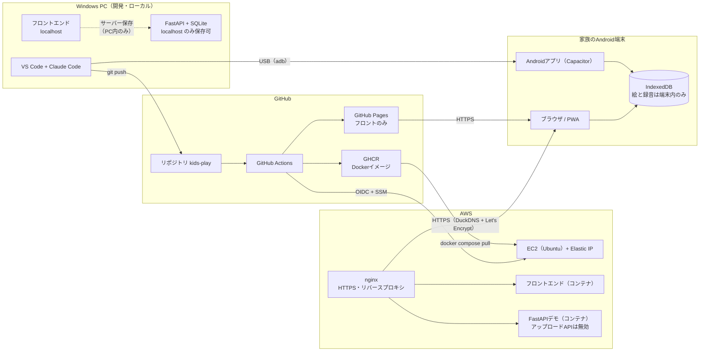
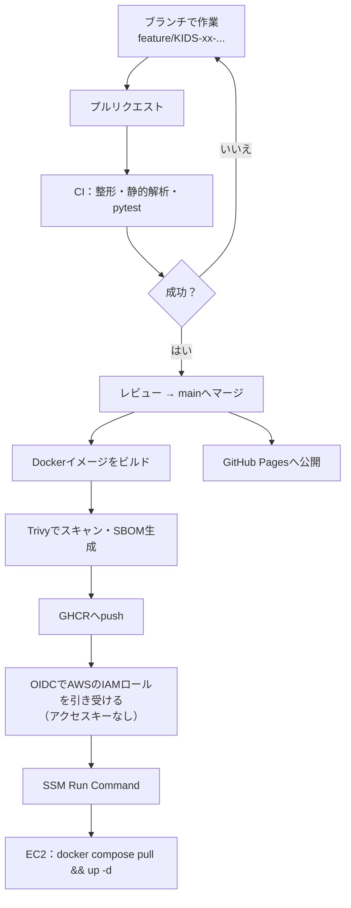

# 構成

雛形。各日の作業で実態に合わせて更新する（⬜＝未構築）。

## 動かす場所の全体像

## データの置き場所（プライバシーの要点）

| 環境 | 絵と録音の保存先 | サーバーへの送信 |
|---|---|---|
| PC（localhost） | IndexedDB、または設定でFastAPI + SQLite | PC内のみ |
| GitHub Pages | IndexedDB（端末内） | なし |
| Androidアプリ / PWA | IndexedDB（端末内） | なし |
| AWS版 | IndexedDB（端末内） | なし（アップロードAPIは無効） |

保存先の切り替えは環境変数で行い、既定は「サーバー保存なし」とする（設定を忘れても安全側に倒れる）。

## CI/CDの流れ

## 構築の状況

| 要素 | 状態 | 構築日 | メモ |
|---|---|---|---|
| ローカルのフロントエンド | ⬜ | 2日目 | |
| GitHub Pages | ⬜ | 5日目 | |
| PWA | ⬜ | 5日目 | |
| Androidアプリ | ⬜ | 6日目 | |
| FastAPI（localhost） | ⬜ | 10日目 | |
| Docker / compose | ⬜ | 11日目 | |
| CI（GitHub Actions、GHCR） | ⬜ | 11日目 | |
| EC2 + nginx（HTTP） | ⬜ | 12日目 | |
| HTTPS（DuckDNS + Let's Encrypt） | ⬜ | 13日目 | |
| CD（OIDC + SSM） | ⬜ | 13日目 | |

## AWSのリソース一覧（12日目から記入。14日目の後片付けの確認に使う）

IDやIPアドレスなど、公開したくない値は書かない（種類と個数だけ書く）。

| リソース | 個数 | 料金が発生する条件 | 削除済み |
|---|---|---|---|
| | | | |
