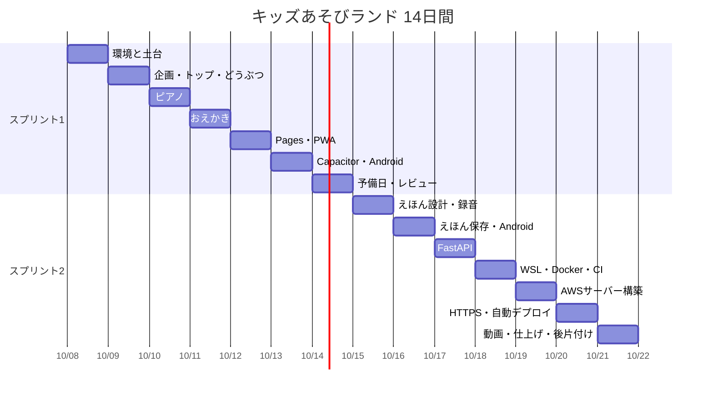

# 14日間の計画

- 期間：2026-10-08（1日目）〜 2026-10-21（14日目）。1日4〜6時間
- 進捗の記録は [learning-log.md](learning-log.md)、課題は Jira（キー：KIDS、元データは [jira-import.csv](jira-import.csv)）
- 状態の記号：⬜ 未着手 ／ 🟨 作業中 ／ ✅ 完了 ／ ⚠️ 遅れ

## 全体の見通し

| スプリント | 日 | ゴール |
|---|---|---|
| スプリント1 | 1〜7日目 | ミニアプリ3つを作り、Web・PWA・Androidで遊べるようにする |
| スプリント2 | 8〜14日目 | えほん、サーバー、Docker、AWS、CI/CD、動画で完成させる |

## スプリント1（1〜7日目）

| 日 | 状態 | やること | 学ぶ技術 | 今日のClaude Code機能 | 今日のセキュリティ作業 | Claude Design作業 | 完了条件 | 目安 |
|---|---|---|---|---|---|---|---|---|
| 1 10/08 | ✅ | 環境構築（uv、Node.js）、Git初期設定、Claude Codeのプロジェクト設定、SSH鍵作成とGitHub登録、リポジトリ kids-play へ接続、Jira登録・スクラムプロジェクト作成・GitHub連携・スプリント1開始、土台ファイル作成 | Git基礎、SSH鍵、GitHub、Jiraの基本 | CLAUDE.md（@参照）、settings.json の権限、カスタムコマンド、/memory、/release-notes | .gitignore と deny 設定で秘密情報を守る。Secret scanning と Push protection の有効化手順を確認 | – | バージョン表が揃う／初回コミットがGitHubにある／Jiraでスプリント1が開始済み／`/start-day` が動く | 4〜5h |
| 2 10/09 | ⬜ | 企画（画面ラフ、ミニアプリの仕様）、Jiraのバックログ整理、トップ画面、どうぶつタッチ。ブランチ→PR→レビュー→マージ | HTML/CSS、ES Modules、SVG、CSSアニメーション、Pointer Events、PRの流れ | Planモード（Shift+Tab）、/clear と /context、チェックポイント（Esc 2回、/rewind） | 脅威分析：データフロー図（Mermaid）、STRIDE、リスク評価と対策を threat-model.md に。資産の明確化、TARAとの対応 | デザインシステムと、トップ・4ミニアプリのプロトタイプ作成。子どもに見せて決定し、実装へ引き継ぐ | トップからどうぶつタッチに移動して遊べる／PRを1本マージ／threat-model.md 初版 | 5〜6h |
| 3 10/10 | ⬜ | おとあそびピアノ | Web Audio API（Oscillator、Gain、エンベロープ）、音量制御、消音 | スキル（.claude/skills/）：同じ作風のSVG素材を作るスキル | 安全なJavaScript（innerHTML不使用、入力の扱い）、ESLintのセキュリティ関連ルール | プロトタイプと実装を見比べ、ずれを修正 | 鍵盤で音が鳴る／消音が効く／初期音量が控えめ／ESLint通過 | 4〜5h |
| 4 10/11 | ⬜ | おえかきスタンプ | Canvas 2D、Pointer Events（筆圧・マルチタッチ）、画像保存（toBlob） | Hooks：編集後にPrettier・ESLint・ruffを自動実行（PostToolUse）、秘密情報へのアクセスをブロック（PreToolUse） | 3日目の続き（ユーザー入力＝描画データの扱い、ダウンロード処理） | デザイン→実装の往復（続き） | 指とマウスで描ける／スタンプが押せる／PNGで保存できる／Hooksが動く | 5〜6h |
| 5 10/12 | ⬜ | GitHub Pagesで公開、PWA化（manifest、Service Worker）、Androidのホーム画面に追加。PCで画面録画（素材①） | GitHub Pages、PWA、キャッシュ戦略、オフライン対応 | サブエージェント（.claude/agents/）：デザインルール確認担当、プライバシー確認担当 | CSP（metaタグ）、Service Workerのキャッシュ範囲確認、Dependabot と CodeQL を有効化 | – | 公開URLで遊べる／機内モードでも起動／Androidのホーム画面から起動／素材①あり | 4〜5h |
| 6 10/13 | ⬜ | Capacitor導入、Android Studioでビルド、USBデバッグで実機インストール。Androidの画面録画（素材②） | Capacitor、Gradle、WebView、adb（Javaとの比較で理解） | MCP：ブラウザ操作（Playwright MCP等）、Jira連携（条件確認後）。AIエージェントのセキュリティ（プロンプトインジェクション、MCPの信頼性、最小権限） | Androidのセキュリティ：最小権限、バックアップ設定、WebView設定、署名鍵の管理 | – | 実機にアプリが入り3つのミニアプリが動く／署名鍵がリポジトリ外／素材②あり | 5〜6h |
| 7 10/14 | ⬜ | 予備日。子どもに遊んでもらい感想をJiraへ。スプリントレビューとレトロスペクティブ、スプリント2の計画と開始。DaVinci Resolveの導入と動作確認、絵コンテ作成 | スクラムのイベント、ベロシティ、DaVinci Resolveの基本 | 振り返り：/usage と /context、1週目をQCDで評価、/release-notes | 脅威分析の見直し（2日目との比較） | 感想を元にプロトタイプ修正、えほん画面のプロトタイプ作成 | スプリント1が完了しスプリント2が開始／絵コンテ完成／DaVinciで試し書き出し成功 | 4〜5h |

## スプリント2（8〜14日目）

| 日 | 状態 | やること | 学ぶ技術 | 今日のClaude Code機能 | 今日のセキュリティ作業 | Claude Design作業 | 完了条件 | 目安 |
|---|---|---|---|---|---|---|---|---|
| 8 10/15 | ⬜ | わたしのえほんの設計（保存処理のインターフェース、画面、保存先の切り替え設定）、録音（MediaRecorder）と再生 | インターフェース設計、MediaRecorder、getUserMedia、Blob | テスト駆動開発（テストを先に書き、失敗を確認してから実装） | 録音データの扱い：マイク権限の要求タイミング | えほん画面のデザインを実装へ引き継ぐ | 録音して再生できる／保存インターフェースが文書化されている | 5〜6h |
| 9 10/16 | ⬜ | えほんのIndexedDB保存。Android版えほん（マイク権限、再ビルド、実機で録音・再生）。サンプルデータで画面録画（素材③） | IndexedDB、Androidのランタイム権限 | git worktree と複数セッションで並列作業 | 端末内保存のみであることの確認（通信の監視）、データ削除機能 | – | 再読み込み後もえほんが残る／実機で録音・再生できる／削除できる／素材③あり | 5〜6h |
| 10 10/17 | ⬜ | FastAPI + SQLiteの保存API（PC内のみ）、保存先の差し替え、公開環境でアップロードAPIが無効になる仕組み、pytest | FastAPI、Pydantic、SQLite、pytest、uv、ruff | /code-review と /security-review、ヘッドレス（claude -p）で定型処理をスクリプト化 | 入力検証、アップロード制限、OWASP Top 10、pip-audit、ruffのセキュリティルール | – | localhostでサーバー保存が動く／無効設定でAPIが拒否することをテストで確認／pytest全通過 | 5〜6h |
| 11 10/18 | ⬜ | WSL2導入とLinuxコマンド復習。Docker Desktop導入、Dockerfileとdocker compose（nginx + フロント + API）。GitHub ActionsでCI（PRでテスト、mainでビルドしGHCRへpush） | WSL2、Linux、Docker、compose、GitHub Actions、GHCR | Claude CodeとGitHub Actionsの連携（費用条件を確認後） | コンテナのセキュリティ：小さいベースイメージ、非root、Trivy、SBOM（CycloneDX）、重大な脆弱性でCIを失敗させる | – | `docker compose up` でローカル起動／PRでCIが緑／GHCRにイメージ／SBOMが成果物にある | 6h |
| 12 10/19 | ⬜ | AWSサーバー構築（HTTP）：アカウント安全設定、EC2・キーペア・Elastic IP・セキュリティグループ、SSH接続・更新・作業用ユーザー・ufw、Docker導入とcompose起動、nginxリバースプロキシ、systemdとログ | AWS（IAM、EC2、SG、EIP）、Ubuntu、SSH、ufw、nginx、systemd、journalctl | サーバー作業での安全な使い方：危険なコマンドの確認・禁止ルール、作業ログの残し方 | サーバーのハードニング：鍵認証のみ、パスワード・rootログイン無効、ufw、unattended-upgrades、IMDSv2必須、SG最小化 | – | 予算アラート・MFA設定済み／Elastic IPにHTTPでデモ版が表示／ハードニング項目を確認済み | 6h |
| 13 10/20 | ⬜ | HTTPS化と自動デプロイ：DuckDNS、certbot、リダイレクトと自動更新、AWS版で録音有効化（端末内保存のみ）、SSM用IAMロール、OIDCプロバイダーとIAMロール、mainマージで自動デプロイ確認、画面録画（素材④） | DNS、TLS、Let's Encrypt、OIDC、IAMロール、SSM Run Command、CD | プラグイン：コマンド・スキル・サブエージェント・Hooksを1つにまとめる | TLS評価（SSL Labs）、セキュリティヘッダー（HSTS、CSP等）、OIDC信頼ポリシーの限定、IAM最小権限、ZAPベースラインスキャン | – | HTTPSで表示／実機ブラウザで録音できる／小さな変更が自動でデプロイされる／素材④あり | 6h |
| 14 10/21 | ⬜ | DaVinci Resolveで1分の紹介動画を編集しREADMEに掲載。README整備。スプリント2のレビューとレトロスペクティブ。AWSを残すか判断し、不要なら全リソース削除。活用ガイドの仕上げ。振り返り | 動画編集（カット、テロップ、音量正規化、色補正、書き出し）、AWSの後片付け | 総まとめ：playbookを「仕事で使えるClaude Code活用ガイド（QCD別）」に仕上げる | security-report.md にまとめる。SECURITY.md 作成 | 成果発表スライド、1枚資料、動画タイトル画像。実装からデザインシステムを読み取り、最初との差を確認 | 動画がREADMEから見られる／security-report.md 完成／AWSの料金発生源がゼロ（または残す判断を記録）／スプリント2完了 | 6h |

## 遅れたときに削る候補（学習の目的は削らない）

優先度の低い順。削る前に必ず確認を取る。

1. 各ミニアプリの見た目の磨き込み（動物やスタンプの種類を減らす：例 6種→3種）
2. 素材②③の録画のやり直し（1テイクで済ませる）
3. 14日目のスライドを1枚資料に統合
4. Claude Designの往復を1回に減らす
5. 7日目の予備日を使い切る

## 発展（15日目以降）

- Terraformによるインフラのコード化
- CloudWatchによる監視とアラート
- 独自ドメインの購入と Route 53
- TypeScriptへの移行、Kotlinでのネイティブ機能
