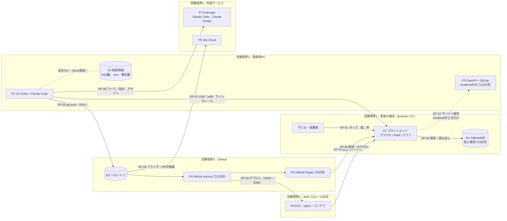

# 脅威分析（Threat Model）

初版（2026-10-09）。7日目に見直す。構成が変わる日（5日目、10日目、11日目、12日目）にも、該当する脅威を見直す。

- 手法：データフロー図 + STRIDE
- 対象：自分が管理するリポジトリ、アプリ、サーバーのみ

## 1. 保護すべき資産

| # | 資産 | なぜ守るか | 置き場所 | 重要度 |
|---|---|---|---|---|
| A1 | 子どもの絵と声 | 子どものプライバシー。流出すると取り返せない | 端末内（IndexedDB）、localhostのSQLite | 高 |
| A2 | 秘密情報（AWS認証情報、SSH秘密鍵、DuckDNSトークン、署名鍵） | 悪用されるとサーバーの乗っ取りや課金につながる | 自分のPC、GitHub Secrets | 高 |
| A3 | サーバー（EC2）とAWSアカウント | 踏み台や不正利用、高額請求 | AWS | 高 |
| A4 | ソースコードと配布物の完全性 | 改ざんされたアプリが子どもの端末で動く | GitHub、GHCR、GitHub Pages | 中 |
| A5 | 子どもの安全な体験（聴覚、目、不適切な内容に触れないこと） | 大音量、激しい点滅、外部リンクや広告は、子どもに直接の害になる | フロントエンドの実装 | 高 |

## 2. データフロー図

枠（subgraph）が信頼境界。枠をまたぐ矢印（DF-xx）が、脅威を探す主な場所になる。
⬜ はまだ作っていない要素（作る日）。7日目の見直しで実態に合わせる。

設計上の要点：DF-01 と DF-02 で扱う絵と声（A1）は、信頼境界1の外へ出る矢印を持たない。DF-10 は開発用PCの中だけで有効になる。

## 3. 脅威の洗い出し（STRIDE）

| STRIDE | 意味 | 車載での例 |
|---|---|---|
| **S**poofing | なりすまし | 不正なECUや診断機のなりすまし |
| **T**ampering | 改ざん | CANメッセージやファームウェアの改ざん |
| **R**epudiation | 否認 | 操作の記録が残らない |
| **I**nformation disclosure | 情報漏えい | 鍵や個人情報の読み出し |
| **D**enial of service | サービス拒否 | バスの占有 |
| **E**levation of privilege | 権限昇格 | 診断セッションの不正な昇格 |

STRIDEの当てはめ方（STRIDE per element）：データフロー（矢印）には T・I・D、プロセス（P）には6つすべて、データストア（D）には T・R・I・D、外部の人やサービスには S・R を当てて考える。

| ID | 対象（要素・データフロー） | STRIDE | 脅威シナリオ | 影響する資産 |
|---|---|---|---|---|
| T-01 | P1 フロントエンド、D1 | I、T | 画面に埋め込まれた悪意あるスクリプト（XSS）が、同じオリジンのIndexedDBから絵と録音を読み出し、外部へ送信する | A1 |
| T-02 | DF-08（Claude Code、Claude Design） | I | 指示やデザインの依頼文に、子どもの実名・写真・絵・声を含めてしまい、外部サービスに送信される | A1 |
| T-03 | DF-03（git push）、D3 | I | 秘密情報（.env、鍵、トークン）を誤ってコミットし、公開リポジトリに push する。履歴に残り、削除しても読める | A2、A3 |
| T-04 | D3、P4（依存パッケージ、Actionsの部品） | T | 取り込んだパッケージやGitHub Actionsの部品に悪意あるコードが入り、ビルドした配布物に混ざる（サプライチェーン） | A4、A1、A2 |
| T-05 | DF-04、DF-05（配信） | T、S | 配信の途中で内容を書き換えられる。または、よく似たURLの偽サイトに誘導され、改ざんされたアプリを使う | A4、A1、A5 |
| T-06 | P1（マイク、8日目〜） | I、E | 子どもが意味を分からずにマイクを許可する。許可が残り、意図しない場面で録音が始まる | A1 |
| T-07 | P6（EC2、12日目〜） | S、E、D | SSHへの総当たりや設定の不備からサーバーに侵入され、踏み台や暗号資産の採掘に使われる。高額な請求が発生する | A3 |
| T-08 | DF-10（サーバー保存） | I | 公開環境で、設定の誤りによりサーバー保存が有効になり、絵と録音がサーバーに送信される | A1 |
| T-09 | D1（IndexedDB） | I | 端末を家族以外が使う、または端末を手放すときに、残っていた絵と録音を見聞きされる | A1 |
| T-10 | P1（音、動き、画面の内容） | T（安全への影響） | 不具合や改ざんにより、急な大音量、激しい点滅、外部サイトへのリンクが子どもに届く | A5 |
| T-11 | P7、DF-08（AIエージェント） | E、T | Claude Codeが読み込んだ外部の文章（Webページ、他者が作った部品の説明）に指示が埋め込まれ、意図しないコマンドの実行や秘密情報の読み出しにつながる（プロンプトインジェクション） | A2、A4 |
| T-12 | D3（リポジトリ） | R | 誰がいつ何を変えたかを追えず、問題のある変更の原因を特定できない | A4 |

STRIDEの6分類のうち、T-10 は当てはまりが悪い。STRIDEは情報の安全（機密性・完全性・可用性など）の分類で、人への直接の害（聴覚、目）を表す項目がないため。ここでは「改ざん・不具合の結果」として T に置いた（6章の気づきを参照）。

## 4. リスク評価

影響度（高3・中2・低1）× 起こりやすさ（高3・中2・低1）で評価する。

| ID | 影響度 | 起こりやすさ | リスク値 | 対応方針（低減・回避・受容・共有） |
|---|---|---|---|---|
| T-01 | 3 | 1 | 3 | 低減（C-06、C-08） |
| T-02 | 3 | 2 | 6 | 回避（C-07。サンプルは自作SVGと合成音のみ） |
| T-03 | 3 | 2 | 6 | 低減（C-01、C-02、C-03） |
| T-04 | 3 | 1 | 3 | 低減（C-06 で依存を持たない。C-09、C-13） |
| T-05 | 3 | 1 | 3 | 低減（C-14。配信はHTTPSのみ） |
| T-06 | 3 | 2 | 6 | 低減（C-10） |
| T-07 | 3 | 2 | 6 | 低減（C-15）。請求は予算アラートで早く気づく |
| T-08 | 3 | 2 | 6 | 低減（C-12。既定で無効、テストで確認） |
| T-09 | 2 | 2 | 4 | 低減（C-11）＋受容（端末の画面ロックは家庭の運用に任せる） |
| T-10 | 3 | 2 | 6 | 低減（C-05、C-06） |
| T-11 | 3 | 2 | 6 | 低減（C-01、C-16） |
| T-12 | 1 | 1 | 1 | 受容（PRとコミットの履歴で追える。C-04） |

起こりやすさを 1 としたものは、今の構成（外部のライブラリも通信もない静的なページ）が前提。構成が変わる日（5日目のPWA、10日目のAPI、11日目の依存パッケージ）に見直す。

## 5. 対策

| ID | 対策 | 対応する脅威 | 実施日 | 状態 | 確認方法（証拠） |
|---|---|---|---|---|---|
| C-01 | .gitignore と Claude Code の deny で秘密情報と子どものデータを除外 | T-03、T-11 | 1日目 | 実施済み | `.gitignore`、`.claude/settings.json` |
| C-02 | GitHubの Secret scanning と Push protection を有効化 | T-03 | 1日目 | 実施済み（アカウント側とリポジトリ側の両方で有効を確認） | アカウントとリポジトリの Settings |
| C-03 | SSH秘密鍵をパスフレーズで保護し、ssh-agent で管理 | T-03 | 1日目 | 実施済み | – |
| C-04 | Jira と GitHub の連携を kids-play のみに限定（最小権限）。変更はブランチ → PR → マージで記録を残す | T-12 | 1日目 | 実施済み | GitHub for Atlassian の設定画面、PRの履歴 |
| C-05 | 音の出口を1モジュールに集め、音量の上限・同時発音数・消音の確認をそこで行う | T-10 | 2日目 | 実施済み | `frontend/js/audio.js`（MASTER_VOLUME、MAX_VOICES） |
| C-06 | innerHTML を使わない。外部のスクリプト・フォント・画像・リンクを置かない。HTMLに style 属性を書かない | T-01、T-04、T-10 | 2日目 | 実施済み（検索で0件） | `frontend/` を innerHTML、style=、http で検索 |
| C-07 | 子どもの実名・写真・絵・声を、外部サービス（Claude、Jira、GitHub）に入力しないルール。反応の記録は個人を特定しない書き方にする | T-02 | 1日目 | 実施済み（運用） | `CLAUDE.md`、`docs/design.md` の反応メモ |
| C-08 | CSP（Content Security Policy）で、読み込み元と通信先を自分のオリジンに限定 | T-01、T-05 | 5日目 | 予定 | – |
| C-09 | Dependabot と CodeQL を有効化 | T-04 | 5日目 | 予定 | – |
| C-10 | マイクの許可は、録音ボタンを押したときだけ求める。録音中であることを画面に示す | T-06 | 8日目 | 予定 | – |
| C-11 | ページの削除と、全データの削除の機能 | T-09 | 9日目 | 予定 | – |
| C-12 | サーバー保存は環境変数で切り替え、既定は無効（fail-safe）。無効のときAPIが拒否することをテストで確認 | T-08 | 10日目 | 予定 | – |
| C-13 | コンテナは小さいベースイメージと非root。Trivy と SBOM。GitHub Actionsの部品はバージョンを固定 | T-04 | 11日目 | 予定 | – |
| C-14 | HTTPSのみで配信。HSTSなどのセキュリティヘッダー | T-05 | 13日目 | 予定 | – |
| C-15 | サーバーのハードニング（鍵認証のみ、ufw、SSHは自分のIPのみ、IMDSv2）。予算アラート、MFA、OIDC（アクセスキーなし） | T-07 | 12〜13日目 | 予定 | – |
| C-16 | Claude Codeが外部から読んだ文章は、指示ではなくデータとして扱う。外部サービスの操作と push は実行前に確認する。MCPは最小権限 | T-11 | 1日目（確認のルール）、6日目（MCP） | 一部実施 | `CLAUDE.md`、`.claude/settings.json` |

## 6. ISO/SAE 21434（TARA）との対応

| ISO/SAE 21434 の活動（15章） | この文書での対応 | 違い・気づき |
|---|---|---|
| アイテム定義（9.3） | 対象範囲、データフロー図 | 車載のアイテム境界に当たるのが信頼境界。Webでは境界の外（ブラウザ、他人のサーバー、依存パッケージ）が広く、自分で管理できない要素が多い |
| 資産の識別（15.3） | 1. 保護すべき資産 | 21434は資産にサイバーセキュリティ特性（C・I・A）を付けてダメージシナリオを導く。ここでは「なぜ守るか」の列がダメージシナリオに当たる |
| 脅威シナリオの識別（15.4） | 3. 脅威の洗い出し（STRIDE） | STRIDEは要素ごとに6分類を機械的に当てるので、漏れを減らせる。21434は手法を指定しないので、TARAの中でSTRIDEを使うこともできる |
| 影響度の評価（15.5） | 4. リスク評価（影響度） | 21434はSFOP（安全・財務・運用・プライバシー）。ここでは主にプライバシーと財務。A5（子どもの聴覚と目）だけが S（安全）に当たり、STRIDEでは表しにくい |
| 攻撃経路の分析（15.6） | 3. の脅威シナリオ | 攻撃ツリーまでは作らず、シナリオの文に経路を含めた。規模が小さいための簡略化 |
| 攻撃の実現可能性の評価（15.7） | 4. リスク評価（起こりやすさ） | 21434の攻撃ポテンシャル（時間、専門知識、機会、機器など）を、3段階の「起こりやすさ」1つに簡略化した。インターネットに公開するので「機会」は常に高い、という点が車載と大きく違う |
| リスク値の決定（15.8） | 4. リスク値 | 影響度 × 起こりやすさ（1〜9）。21434のリスクマトリクス（1〜5）に当たる |
| リスク対応の決定（15.9） | 4. 対応方針、5. 対策 | 低減・回避・受容・共有の4つは同じ。T-02（子どもの情報を入れない）は「回避」の例 |
| サイバーセキュリティ目標・要求（9.4、9.5） | 5. 対策 | 対策に「確認方法（証拠）」の列を付け、要求と検証の対応を残した。21434の検証・妥当性確認に当たる |

## 7. 見直しの履歴

| 日付 | 変更内容 | きっかけ |
|---|---|---|
| 2026-10-08 | 雛形を作成。資産A1〜A4と対策C-01、C-02を仮置き | 1日目 |
| 2026-10-09 | 初版。資産A5、データフロー図（信頼境界5つ、DF-01〜DF-10）、脅威T-01〜T-12、リスク評価、対策C-05〜C-16、TARAとの対応を追加 | 2日目。Claude Designの使い方の変更（DF-08）と、音の実装（C-05）を反映 |
