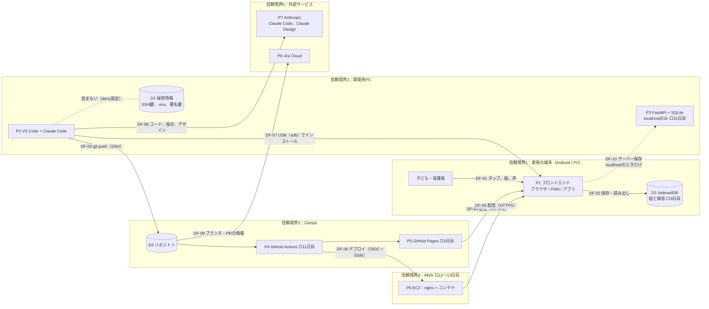

# 脅威分析（Threat Model）

雛形。2日目に初版を作成し、7日目に見直す。

- 手法：データフロー図 + STRIDE
- 対象：自分が管理するリポジトリ、アプリ、サーバーのみ

## 1. 保護すべき資産

| # | 資産 | なぜ守るか | 置き場所 | 重要度 |
|---|---|---|---|---|
| A1 | 子どもの絵と声 | 子どものプライバシー。流出すると取り返せない | 端末内（IndexedDB）、localhostのSQLite | 高 |
| A2 | 秘密情報（AWS認証情報、SSH秘密鍵、DuckDNSトークン、署名鍵） | 悪用されるとサーバーの乗っ取りや課金につながる | 自分のPC、GitHub Secrets | 高 |
| A3 | サーバー（EC2）とAWSアカウント | 踏み台や不正利用、高額請求 | AWS | 高 |
| A4 | ソースコードと配布物の完全性 | 改ざんされたアプリが子どもの端末で動く | GitHub、GHCR、GitHub Pages | 中 |
| A5 | 子どもの安全な体験（聴覚、目、不適切な内容に触れないこと） | 大音量、激しい点滅、外部リンクや広告は、子どもに直接の害になる | フロントエンドの実装 | 高 |

## 2. データフロー図

枠（subgraph）が信頼境界。枠をまたぐ矢印（DF-xx）が、脅威を探す主な場所になる。
⬜ はまだ作っていない要素（作る日）。7日目の見直しで実態に合わせる。

設計上の要点：DF-01 と DF-02 で扱う絵と声（A1）は、信頼境界1の外へ出る矢印を持たない。DF-10 は開発用PCの中だけで有効になる。

## 3. 脅威の洗い出し（STRIDE）

| STRIDE | 意味 | 車載での例 |
|---|---|---|
| **S**poofing | なりすまし | 不正なECUや診断機のなりすまし |
| **T**ampering | 改ざん | CANメッセージやファームウェアの改ざん |
| **R**epudiation | 否認 | 操作の記録が残らない |
| **I**nformation disclosure | 情報漏えい | 鍵や個人情報の読み出し |
| **D**enial of service | サービス拒否 | バスの占有 |
| **E**levation of privilege | 権限昇格 | 診断セッションの不正な昇格 |

STRIDEの当てはめ方（STRIDE per element）：データフロー（矢印）には T・I・D、プロセス（P）には6つすべて、データストア（D）には T・R・I・D、外部の人やサービスには S・R を当てて考える。

| ID | 対象（要素・データフロー） | STRIDE | 脅威シナリオ | 影響する資産 |
|---|---|---|---|---|
| T-01 | P1 フロントエンド、D1 | I、T | 画面に埋め込まれた悪意あるスクリプト（XSS）が、同じオリジンのIndexedDBから絵と録音を読み出し、外部へ送信する | A1 |
| T-02 | DF-08（Claude Code、Claude Design） | I | 指示やデザインの依頼文に、子どもの実名・写真・絵・声を含めてしまい、外部サービスに送信される | A1 |
| T-03 | | | | |
| T-04 | | | | |
| T-05 | | | | |
| T-06 | | | | |

T-01 と T-02 は書き方の見本。T-03 以降は、次の問いを手がかりに書く。

- DF-03：誤って秘密情報をコミットして push したら？（I）
- D3、P4：依存パッケージやGitHub Actionsの部品が改ざんされていたら？（T）
- DF-04、DF-05：配信の途中や配信元で、アプリが書き換えられたら？（T、S）
- P1：マイクの許可を、子どもが意味を分からずに押したら？ 録音が意図せず始まったら？（I、E）
- P6：サーバーに不正ログインされたら？ 高額請求が起きたら？（S、E、D）
- DF-10：公開環境で、サーバー保存が誤って有効になったら？（I）
- D1：端末を他人が使ったら？ 端末を手放すときは？（I）

## 4. リスク評価

影響度（高3・中2・低1）× 起こりやすさ（高3・中2・低1）で評価する。

| ID | 影響度 | 起こりやすさ | リスク値 | 対応方針（低減・回避・受容・共有） |
|---|---|---|---|---|
| T-01 | 3 | 1 | 3 | 低減（innerHTMLを使わない、外部スクリプトを読み込まない、CSP） |
| T-02 | 3 | 2 | 6 | 回避（ルールで禁止。サンプルは自作SVGと合成音のみ） |
| T-03 | | | | |

## 5. 対策

| ID | 対策 | 対応する脅威 | 実施日 | 状態 | 確認方法（証拠） |
|---|---|---|---|---|---|
| C-01 | .gitignore と Claude Code の deny で秘密情報と子どものデータを除外 | （2日目に対応付け） | 1日目 | 実施済み | `.gitignore`、`.claude/settings.json` |
| C-02 | GitHubの Secret scanning と Push protection を有効化 | | 1日目 | 実施済み（アカウント側とリポジトリ側の両方で有効を確認） | アカウントとリポジトリの Settings |
| C-03 | SSH秘密鍵をパスフレーズで保護し、ssh-agent で管理 | | 1日目 | 実施済み | – |
| C-04 | Jira と GitHub の連携を kids-play のみに限定（最小権限） | | 1日目 | 実施済み | GitHub for Atlassian の設定画面 |

## 6. ISO/SAE 21434（TARA）との対応

| ISO/SAE 21434 の活動（15章） | この文書での対応 | 違い・気づき |
|---|---|---|
| アイテム定義（9.3） | 対象範囲、データフロー図 | |
| 資産の識別（15.3） | 1. 保護すべき資産 | |
| 脅威シナリオの識別（15.4） | 3. 脅威の洗い出し（STRIDE） | |
| 影響度の評価（15.5） | 4. リスク評価（影響度） | 21434はSFOP（安全・財務・運用・プライバシー）。ここでは主にプライバシーと財務 |
| 攻撃経路の分析（15.6） | 3. の脅威シナリオ | |
| 攻撃の実現可能性の評価（15.7） | 4. リスク評価（起こりやすさ） | |
| リスク値の決定（15.8） | 4. リスク値 | |
| リスク対応の決定（15.9） | 4. 対応方針、5. 対策 | |
| サイバーセキュリティ目標・要求（9.4、9.5） | 5. 対策 | |

## 7. 見直しの履歴

| 日付 | 変更内容 | きっかけ |
|---|---|---|
| 2026-10-08 | 雛形を作成。資産A1〜A4と対策C-01、C-02を仮置き | 1日目 |
